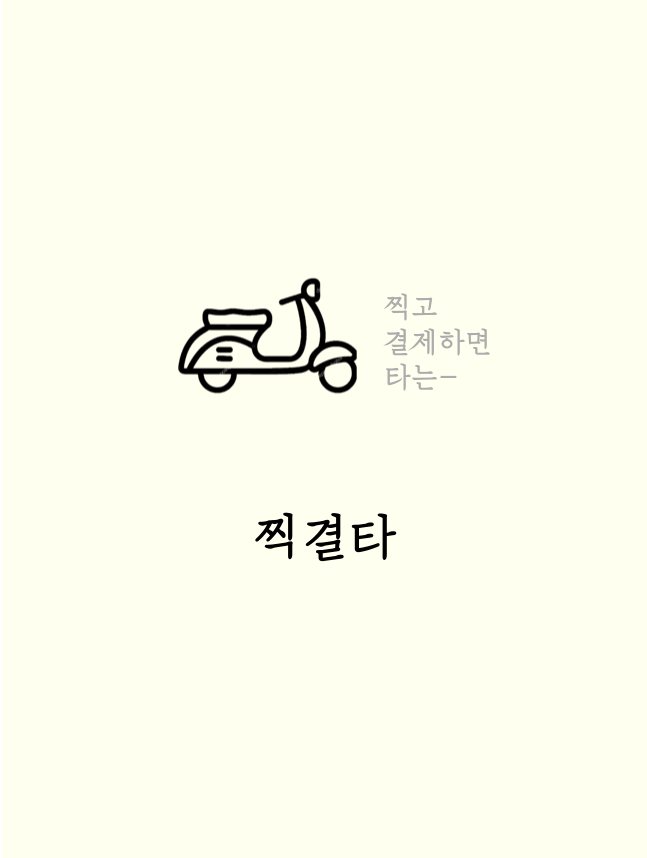
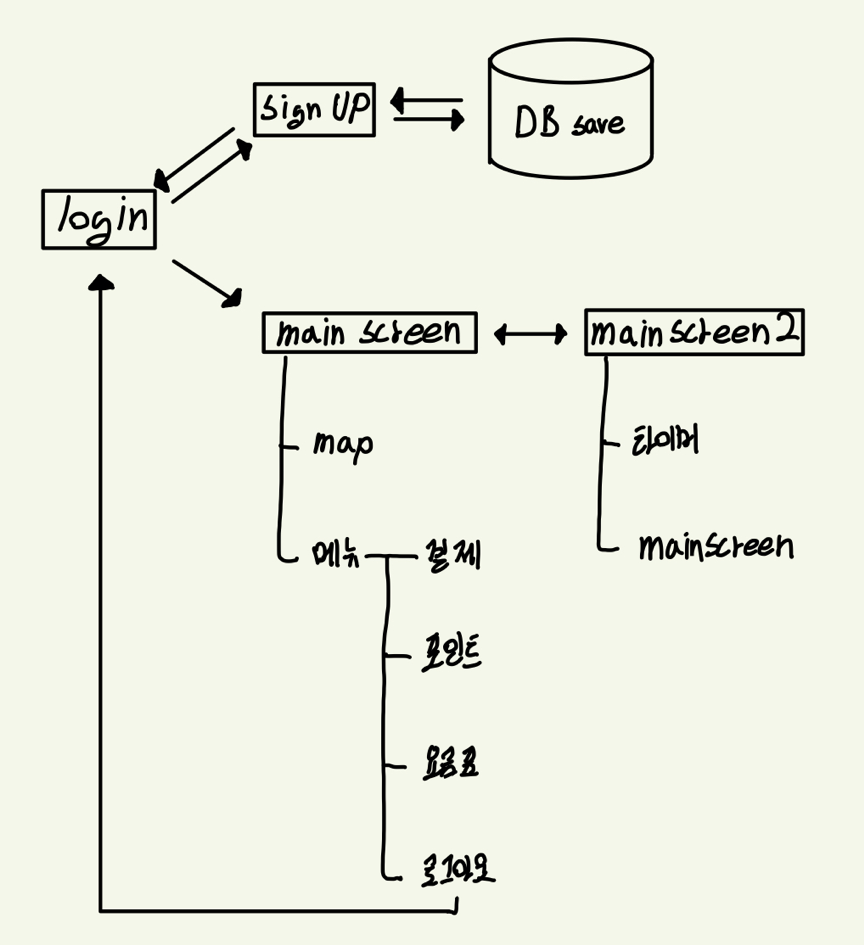
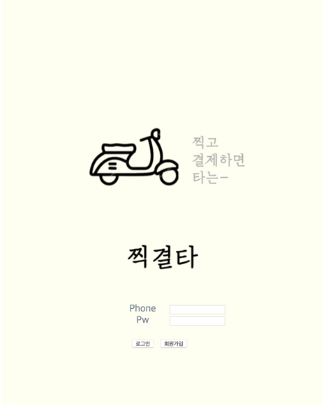
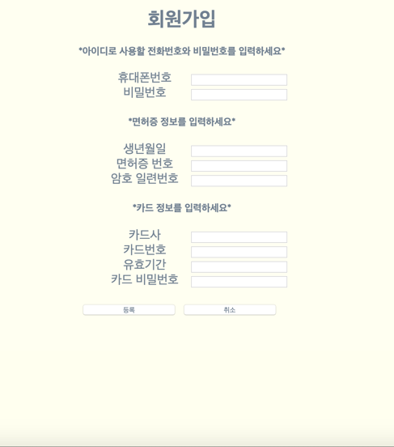
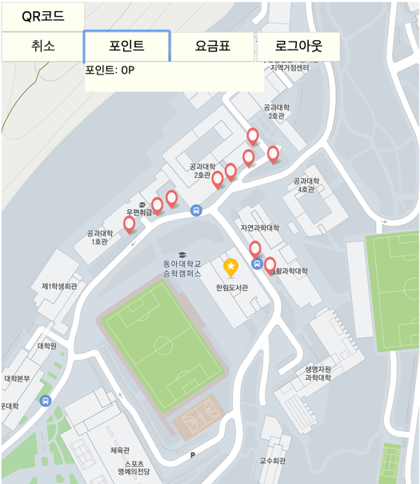
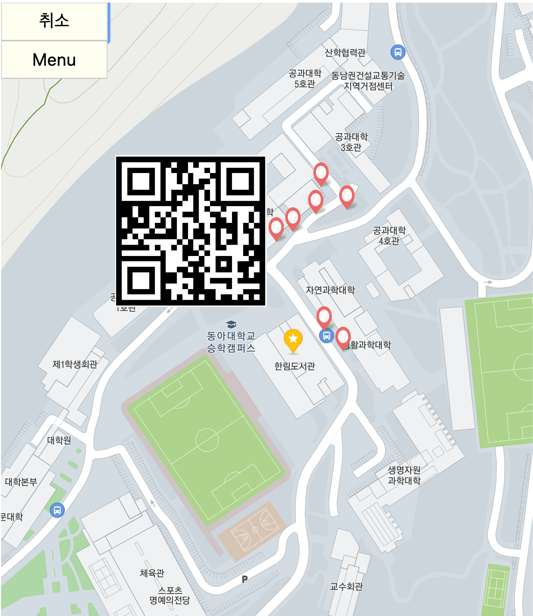
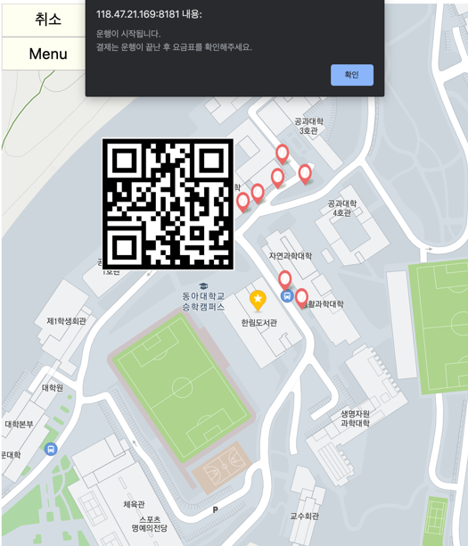

# 찍고 결제하면 바로 타는 - 찍결타 🛵
 

 

## ✔️ 강의명

> 소프트웨어 공학(팀과제 수업)

## ✔️ 과제 설계 방식

> 안드로이드 앱에 탑재된 웹애플리케이션 제작

## ✔️ 팀 구성

> 인원 수: 4명 (front-end 2명, back-end 2명) 
> 담당 역할: Kakao map api를 활용, 메인 화면을 지도로 구성 
> 캠퍼스 중앙도서관을 기준으로 전동 스쿠터들의 현재 위치 표시(가상의 스쿠터)

## ✔️ 기술스택

> HTML, JavaScript, CSS, JSP, JQuery 
> Oracle DB 
> Kakao map api (기술문서: http://apis.map.kakao.com/web/documentation/)

 

## ✔️ 소비자 요구분석

 

*  **문제분석 및 해결방안**

| 문제                                                         | 해결방안                                                     |
| ------------------------------------------------------------ | ------------------------------------------------------------ |
| 등교 시간대, 학생들이 밀집되어 도로가 택시, 버스 등으로 포화, 학교에 올라가기가 어려움. | 전동 스쿠터로 이면도로를 이용하면 도로의 차량도 줄고 더 많은 학생들이 이동할 수 있다. |
| 기존 스쿠터 렌트 서비스들은 대여시간 단위가 크고, 대여비용도 그에 비례한다. | 필요한 시간만큼만 즉시 대여하고 반납할 수 있으므로 시간 조건에 구애받지 않고 이용 가능하다. |
| 기존 렌트 서비스는 대여 절차가 간단하지 않아 급하게 필요한 때에 빠르게 이용하기 어렵다. | 앱을 켜고 근처에 위치한 기기를 찾아 QR코드로 찍고 타기만 하면 되므로 불필요한 절차 생략. |
| 빠른 시간 내에 간편하게 접근할 수 있는 구조의 앱이어야 한다. | 웹 앱으로 구현함으로써 고객이 상황에 따라 웹사이트, 스마트폰 앱 등으로 유연하게 접근 가능하다. |

 

*  **전공관 앞 학생들의 시간대별 스쿠터 이용비율**

## ✔️ Flow Chart

* **Login:** 휴대전화 번호(ID)와 비밀번호로 로그인
* **Signup:** 휴대전화 번호(ID), 비밀번호, 면허증 정보(생년월일, 면허증 번호, 암호 일련번호), 카드 정보(카드사, 카드번호, 유효기간, 카드 비밀번호)
* **main_screen, main_screen2:** 기본 메인화면. 현재 위치를 기반으로 근처 스쿠터의 위치를 핀으로 보여준다. 핀을 터치하면 현재 위치로부터 거리를 km단위로 알려주고, 스쿠터의 상태를 알려준다.
* **Database:** 휴대전화 번호, 비밀번호, 면허증 정보(생년월일, 면허증 번호, 암호 일련번호), 카드 정보(카드사, 카드번호, 유효기간, 카드 비밀번호), 포인트 정보를 저장한다.

> 근처 스쿠터에 부착되어 있는 고유 QR코드를 인식하면 탑승이 가능하고, 이용시간(main_screen2)을 실시간으로 화면에 보여준다. 
> 목적지에 도착 후, 결제버튼을 누르면 이용요금이 요금표를 기준으로 등록된 카드에서 결제된다(main_screen으로 복귀) 
> 포인트는 서비스를 이용하고 결제할 때마다 일정 비율로 누적된다. 이는 결제 시 현금과 동일하게 사용 가능. 
> 맵을 이동하다가 새로고침 버튼을 누르면 맵 화면이 현재 위치로 돌아온다.

 

## ✔️ 구현화면
| 📷 로그인 화면 | 📷 회원가입 화면 | 📷 기본 메인화면 |
|:-----------:|:-------------:|:-------------:|
|  |  |  |
| 📷 메인화면(포인트) | 📷 메인화면(QR인식) | 📷 메인화면(운행시작) |
|  |  |  |
| 📷 메인화면(타이머시작) | 📷 메인화면(운행종료) |
|  |  |